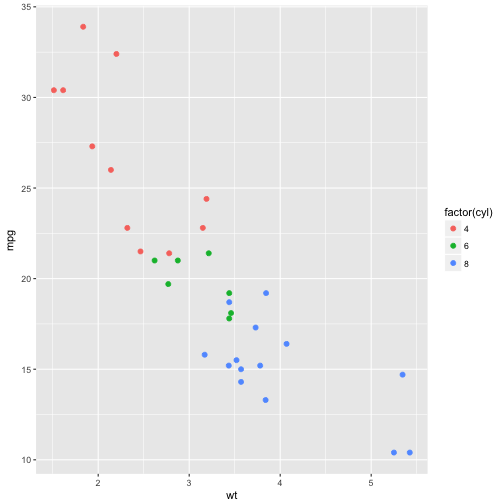
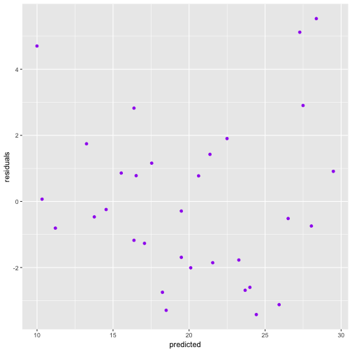

--- 
title: Dependance of Fuel Efficiency on Transmission Type 
author: "Peter Thompson"
---
# Dependance of Fuel Efficiency on Transmission Type 

<!-- Instructions

You work for Motor Trend, a magazine about the automobile industry. Looking at a data set of a collection of cars, they are interested in exploring the relationship between a set of variables and miles per gallon (MPG) (outcome). They are particularly interested in the following two questions:

“Is an automatic or manual transmission better for MPG”
"Quantify the MPG difference between automatic and manual transmissions"
Review criterialess
Peer Grading

The criteria that your classmates will use to evaluate and grade your work are shown below.
Each criteria is binary: (1 point = criteria met acceptably; 0 points = criteria not met acceptably)
Criteria

Did the student interpret the coefficients correctly?
Did the student do some exploratory data analyses?
Did the student fit multiple models and detail their strategy for model selection?
Did the student answer the questions of interest or detail why the question(s) is (are) not answerable?
Did the student do a residual plot and some diagnostics?
Did the student quantify the uncertainty in their conclusions and/or perform an inference correctly?
Was the report brief (about 2 pages long) for the main body of the report and no longer than 5 with supporting appendix of figures?
Did the report include an executive summary?
Was the report done in Rmd (knitr)? -->


## Executive Summary

## stuff
quick summary


```r
library(ggplot2)
str(mtcars)
```

```
## 'data.frame':	32 obs. of  11 variables:
##  $ mpg : num  21 21 22.8 21.4 18.7 18.1 14.3 24.4 22.8 19.2 ...
##  $ cyl : num  6 6 4 6 8 6 8 4 4 6 ...
##  $ disp: num  160 160 108 258 360 ...
##  $ hp  : num  110 110 93 110 175 105 245 62 95 123 ...
##  $ drat: num  3.9 3.9 3.85 3.08 3.15 2.76 3.21 3.69 3.92 3.92 ...
##  $ wt  : num  2.62 2.88 2.32 3.21 3.44 ...
##  $ qsec: num  16.5 17 18.6 19.4 17 ...
##  $ vs  : num  0 0 1 1 0 1 0 1 1 1 ...
##  $ am  : num  1 1 1 0 0 0 0 0 0 0 ...
##  $ gear: num  4 4 4 3 3 3 3 4 4 4 ...
##  $ carb: num  4 4 1 1 2 1 4 2 2 4 ...
```

mainly interested in mpg vs am.
would expect that horespower, number of cylinders, engine displacement, and vehicle weight would also influence fuel efficiency
Check the correlation between some of these other (confounding) variables, may not need to include all of them in our model

change this into a table so it takes up less space

```r
cor(mtcars$wt,mtcars$hp)
```

```
## [1] 0.6587479
```

```r
cor(mtcars$wt,mtcars$disp)
```

```
## [1] 0.8879799
```

```r
cor(mtcars$wt,mtcars$cyl)
```

```
## [1] 0.7824958
```

```r
cor(mtcars$cyl,mtcars$hp)
```

```
## [1] 0.8324475
```

```r
cor(mtcars$cyl,mtcars$disp)
```

```
## [1] 0.9020329
```

```r
cor(mtcars$hp,mtcars$disp)
```

```
## [1] 0.7909486
```
displacement is pretty highly correlated with the other variables, so it may not be needed. Weight has relatively low correlations, so should be considered in addition to other variables. This is not to say that weight has the most impact on mpg, just that it might explain variation in mpg that is not covered by other (more correlated) variables.

consider mpg vs am
mpg vs am + disp
mpg vs am + disp + cyl
mpg vs am + disp + cyl + wt

<!-- Did the student fit multiple models and detail their strategy for model selection? -->
Fit some models. 


```r
fit1<-lm(data=mtcars,mpg ~ factor(am))
fit2<-lm(data=mtcars,mpg ~ factor(am) + wt   )
fit3<-lm(data=mtcars,mpg ~ factor(am) + wt  + hp )
fit4<-lm(data=mtcars,mpg ~ factor(am) + wt  + hp + cyl)
fit5<-lm(data=mtcars,mpg ~ factor(am) + wt  + hp + cyl + disp)
```

which model is best? used nested stuff and anova to determine most suitable model. more parameters will always give a better fit, but want to check that there is **significant** improvement in the model for each additional variable. Wald test / F statistic to check this.


```r
anova(fit1,fit2,fit3,fit4,fit5)
```

```
## Analysis of Variance Table
## 
## Model 1: mpg ~ factor(am)
## Model 2: mpg ~ factor(am) + wt
## Model 3: mpg ~ factor(am) + wt + hp
## Model 4: mpg ~ factor(am) + wt + hp + cyl
## Model 5: mpg ~ factor(am) + wt + hp + cyl + disp
##   Res.Df    RSS Df Sum of Sq       F    Pr(>F)    
## 1     30 720.90                                   
## 2     29 278.32  1    442.58 70.5432 7.017e-09 ***
## 3     28 180.29  1     98.03 15.6250 0.0005286 ***
## 4     27 170.00  1     10.29  1.6407 0.2115417    
## 5     26 163.12  1      6.88  1.0963 0.3047194    
## ---
## Signif. codes:  0 '***' 0.001 '**' 0.01 '*' 0.05 '.' 0.1 ' ' 1
```
The F statistic comparing fit4 (which includes am, wt, hp, and cyl as regressors) to fit3 (which does not include cyl) is 1.64, which corresponds to a significance of 78.8 %. That is, we are 78.8% confident that fit4 is a better model than fit3. We require 95% significance (or a p value below 0.05), and so we reject fit4 (and subsequently fit5).

plot of  (residuals vs model prediction) is included in appendix. Residuals in this plot do not appear to be systematically distributed, which suggests that there are no obvious problems with our fit.

look at the coefficients for fit3


```r
sum3<-summary(fit3)
coef(sum3)
```

```
##                Estimate  Std. Error   t value     Pr(>|t|)
## (Intercept) 34.00287512 2.642659337 12.866916 2.824030e-13
## factor(am)1  2.08371013 1.376420152  1.513862 1.412682e-01
## wt          -2.87857541 0.904970538 -3.180850 3.574031e-03
## hp          -0.03747873 0.009605422 -3.901830 5.464023e-04
```

```r
#fit3$coeff
```
The coefficient for the am variable is 2.08. That is, our model estimates that manual transmission vehicles (am=1) have fuel efficiency that is 2.08 mpg higher than automatic transmission vehicles, when vehicle weight and horsepower are held constant. However, there is a relatively large degree of uncertainty in this parameter. The p-value for this parameter is 0.14, whereas we require a p-value less than 0.05 for 95% confidence. That is,  **the effect of transmission type on fuel efficiency is not statistically significant at the 95% level**. We cannot reject the null hypothesis (that this model parameter is zero/that transmission type has no effect on fuel efficiency).


 
<!-- [, 1]  mpg   Miles/(US) gallon
[, 2]  cyl   Number of cylinders
[, 3]  disp  Displacement (cu.in.)
[, 4]  hp    Gross horsepower
[, 5]  drat  Rear axle ratio
[, 6]  wt    Weight (1000 lbs)
[, 7]  qsec  1/4 mile time
[, 8]  vs    V/S
[, 9]  am    Transmission (0 = automatic, 1 = manual)
[,10]  gear  Number of forward gears
[,11]  carb  Number of carburetors     -->

## Appendix
<!-- 3 pages, just figures -->
#exploratory plot

```r
h<-ggplot(data=mtcars,aes(y=mpg,x=wt,colour=factor(cyl))) + geom_point(size=2) 
print(h)
```



some pair plots here, mpg vs stuff, and maybe stuff vs other stuff


```r
fitdata<-data.frame(residuals=resid(fit3),predicted=predict(fit3))
j<-ggplot(data=fitdata,aes(x=predicted,y=residuals)) + geom_point(colour='purple')
print(j)
```


