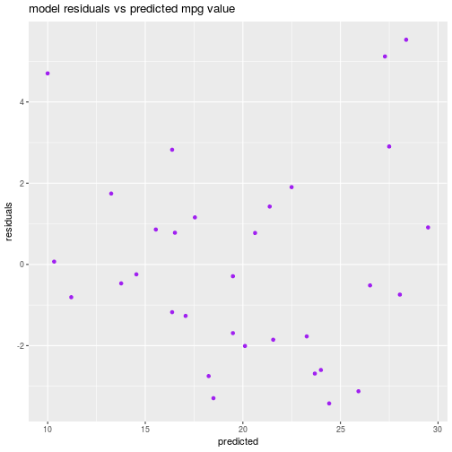

--- 
title: Effect of Transmission Type on Fuel Efficiency
author: "Peter Thompson"
---
<!-- # Dependance of Fuel Efficiency on Transmission Type  -->

<!-- Instructions

You work for Motor Trend, a magazine about the automobile industry. Looking at a data set of a collection of cars, they are interested in exploring the relationship between a set of variables and miles per gallon (MPG) (outcome). They are particularly interested in the following two questions:

“Is an automatic or manual transmission better for MPG”
"Quantify the MPG difference between automatic and manual transmissions"
Review criterialess
Peer Grading

The criteria that your classmates will use to evaluate and grade your work are shown below.
Each criteria is binary: (1 point = criteria met acceptably; 0 points = criteria not met acceptably)
Criteria

Did the student interpret the coefficients correctly?
Did the student do some exploratory data analyses?
Did the student fit multiple models and detail their strategy for model selection?
Did the student answer the questions of interest or detail why the question(s) is (are) not answerable?
Did the student do a residual plot and some diagnostics?
Did the student quantify the uncertainty in their conclusions and/or perform an inference correctly?
Was the report brief (about 2 pages long) for the main body of the report and no longer than 5 with supporting appendix of figures?
Did the report include an executive summary?
Was the report done in Rmd (knitr)? -->


## Executive Summary
The mtcars dataset was analysed to determine whether manual or automatic cars have better fuel efficiency (higher mpg). A linear model was fit to the data, which included the effects of transmission type, vehicle weight, and horsepower on mpg. The model predicts only a small difference (2.08 mpg) between manual and automatic vehicles (manual transmission being more efficient), but this difference is **not statistically significant**. We conclude that there is no significant difference in fuel efficiency between manual and automatic vehicles when other characteristics are accounted for.  

## Analysis
The mtcars dataset contains the folowing variables:


```r
str(mtcars)
```

```
## 'data.frame':	32 obs. of  11 variables:
##  $ mpg : num  21 21 22.8 21.4 18.7 18.1 14.3 24.4 22.8 19.2 ...
##  $ cyl : num  6 6 4 6 8 6 8 4 4 6 ...
##  $ disp: num  160 160 108 258 360 ...
##  $ hp  : num  110 110 93 110 175 105 245 62 95 123 ...
##  $ drat: num  3.9 3.9 3.85 3.08 3.15 2.76 3.21 3.69 3.92 3.92 ...
##  $ wt  : num  2.62 2.88 2.32 3.21 3.44 ...
##  $ qsec: num  16.5 17 18.6 19.4 17 ...
##  $ vs  : num  0 0 1 1 0 1 0 1 1 1 ...
##  $ am  : num  1 1 1 0 0 0 0 0 0 0 ...
##  $ gear: num  4 4 4 3 3 3 3 4 4 4 ...
##  $ carb: num  4 4 1 1 2 1 4 2 2 4 ...
```

We are mainly interested in fuel efficiency (mpg) vs transmission type (am). Horespower, number of cylinders, engine displacement, and vehicle weight may also influence fuel efficiency. Some of these variables may be highly correlated, so it's possible that they don't all need to be included in the model. An exploratory pair plot (with variable correlations) is included in the appendix.


<!-- ```{r}
cor(mtcars$wt,mtcars$hp)
cor(mtcars$wt,mtcars$disp)
cor(mtcars$wt,mtcars$cyl)
cor(mtcars$cyl,mtcars$hp)
cor(mtcars$cyl,mtcars$disp)
cor(mtcars$hp,mtcars$disp)
``` -->

Displacement is pretty highly correlated with the other variables, so it may not be needed. Weight has relatively low correlation, so should be considered in addition to other variables. This is not to say that weight has the most impact on mpg, just that it might explain variation in mpg that is not covered by other (more correlated) variables.

<!-- Did the student fit multiple models and detail their strategy for model selection? -->
Linear models will be used to predict mpg using combinations of am, wt, hp, cyl, and disp as regressors. The models will be fit in a nested fashion, and then the variance will be analysed to determine the most appropriate model.


```r
fit1<-lm(data=mtcars,mpg ~ factor(am))
fit2<-lm(data=mtcars,mpg ~ factor(am) + wt   )
fit3<-lm(data=mtcars,mpg ~ factor(am) + wt  + hp )
fit4<-lm(data=mtcars,mpg ~ factor(am) + wt  + hp + cyl)
fit5<-lm(data=mtcars,mpg ~ factor(am) + wt  + hp + cyl + disp)
```

More model parameters (regressors) will always give a better fit, but we want to check that there is **significant** improvement in the model for each variable added. The F statistic will be used to check this (we will consider improvement significant if it exceeds a 95% threshold).


```r
anova(fit1,fit2,fit3,fit4,fit5)
```

```
## Analysis of Variance Table
## 
## Model 1: mpg ~ factor(am)
## Model 2: mpg ~ factor(am) + wt
## Model 3: mpg ~ factor(am) + wt + hp
## Model 4: mpg ~ factor(am) + wt + hp + cyl
## Model 5: mpg ~ factor(am) + wt + hp + cyl + disp
##   Res.Df    RSS Df Sum of Sq       F    Pr(>F)    
## 1     30 720.90                                   
## 2     29 278.32  1    442.58 70.5432 7.017e-09 ***
## 3     28 180.29  1     98.03 15.6250 0.0005286 ***
## 4     27 170.00  1     10.29  1.6407 0.2115417    
## 5     26 163.12  1      6.88  1.0963 0.3047194    
## ---
## Signif. codes:  0 '***' 0.001 '**' 0.01 '*' 0.05 '.' 0.1 ' ' 1
```
The F statistic comparing fit4 (which includes am, wt, hp, and cyl as regressors) to fit3 (which does not include cyl) is 1.64, which corresponds to a significance of 78.8 %. That is, we are 78.8% confident that fit4 is a better model than fit3. As this is less than the 95% required, we reject fit4 (and subsequently fit5).

A plot of the residuals vs the fit3 model predictions is included in appendix. Residuals in this plot do not appear to be systematically distributed, which suggests that there are no obvious problems with our fit. 

The coefficients of the model describe the effect of the regression variables on fuel efficiency. Specifically, the am coefficient gives the change fuel efficiency when the transmission changes from automatic (am=0) to manual (am=1).


```r
sum3<-summary(fit3)
coef(sum3)
```

```
##                Estimate  Std. Error   t value     Pr(>|t|)
## (Intercept) 34.00287512 2.642659337 12.866916 2.824030e-13
## factor(am)1  2.08371013 1.376420152  1.513862 1.412682e-01
## wt          -2.87857541 0.904970538 -3.180850 3.574031e-03
## hp          -0.03747873 0.009605422 -3.901830 5.464023e-04
```

## Conclusion
The coefficient for the am variable is 2.08 $\pm$ 1.38 mpg. That is, our model estimates that manual transmission vehicles (am=1) have fuel efficiency that is 2.08 mpg higher than automatic transmission vehicles, when vehicle weight and horsepower are held constant. However, there is a relatively large degree of uncertainty in this parameter. The p-value for this parameter is 0.14, whereas we require a p-value less than 0.05 for 95% confidence. That is,  **the effect of transmission type on fuel efficiency is not statistically significant at the 95% level**. We cannot reject the null hypothesis (that this model parameter is zero/that transmission type has no effect on fuel efficiency).


 
<!-- [, 1]  mpg   Miles/(US) gallon
[, 2]  cyl   Number of cylinders
[, 3]  disp  Displacement (cu.in.)
[, 4]  hp    Gross horsepower
[, 5]  drat  Rear axle ratio
[, 6]  wt    Weight (1000 lbs)
[, 7]  qsec  1/4 mile time
[, 8]  vs    V/S
[, 9]  am    Transmission (0 = automatic, 1 = manual)
[,10]  gear  Number of forward gears
[,11]  carb  Number of carburetors     -->

## Appendix
<!-- 3 pages, just figures -->
exploratory pair plot

```r
library(ggplot2)
library(GGally)
```

```
## Warning: replacing previous import by 'utils::capture.output' when loading
## 'GGally'
```

```
## Warning: replacing previous import by 'utils::head' when loading 'GGally'
```

```
## Warning: replacing previous import by 'utils::installed.packages' when
## loading 'GGally'
```

```
## Warning: replacing previous import by 'utils::str' when loading 'GGally'
```

```r
k<-ggpairs(data=mtcars,columns=c(1,2,4,6,9),mapping=aes(colour='red'))
print(k)
```


<!-- ```{r}
library(ggplot2)
h<-ggplot(data=mtcars,aes(y=mpg,x=wt,colour=factor(am),pch=factor(cyl) )) + geom_point(size=2) + labs(x='vehicle weight (1000 lbs)',y='fuel efficiency (mpg)',colour='transmission',pch='cylinders',title='fuel efficiency vs vehicle weight')
print(h)
``` -->

residual plot

```r
fitdata<-data.frame(residuals=resid(fit3),predicted=predict(fit3))
j<-ggplot(data=fitdata,aes(x=predicted,y=residuals)) + geom_point(colour='purple') + labs(title='model residuals vs predicted mpg value')
print(j)
```




