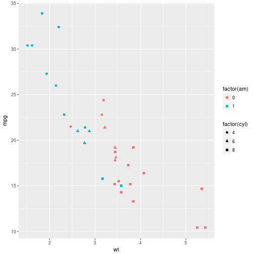

Goofing around in R. Check that stuff makes sense

look at mtcars. mpg vs wt


```r
library(ggplot2)
g<-ggplot(data=mtcars,aes(x=wt,y=mpg)) + geom_point(colour='purple',alpha=0.5) + geom_smooth(method='lm')
print(g)
```



Get R to compute the fit.


```r
thefit<-lm(data=mtcars,mpg~wt)
summary(thefit)
```

```
## 
## Call:
## lm(formula = mpg ~ wt, data = mtcars)
## 
## Residuals:
##     Min      1Q  Median      3Q     Max 
## -4.5432 -2.3647 -0.1252  1.4096  6.8727 
## 
## Coefficients:
##             Estimate Std. Error t value Pr(>|t|)    
## (Intercept)  37.2851     1.8776  19.858  < 2e-16 ***
## wt           -5.3445     0.5591  -9.559 1.29e-10 ***
## ---
## Signif. codes:  0 '***' 0.001 '**' 0.01 '*' 0.05 '.' 0.1 ' ' 1
## 
## Residual standard error: 3.046 on 30 degrees of freedom
## Multiple R-squared:  0.7528,	Adjusted R-squared:  0.7446 
## F-statistic: 91.38 on 1 and 30 DF,  p-value: 1.294e-10
```

describe our line ($y = \beta_0 + \beta_1 x$)


```r
beta1=thefit$coeff[2]
beta0=thefit$coeff[1]
e<-resid(thefit)
n<-length(e)
```
note that $\beta_1 = corr(x,y) \frac{s_y}{s_x}$, where $s_y$ and $s_x$ are the sample standard deviations of the regressor and predictor, respectively. $\beta_0$ should be chosen such that the slope passes through the point $(\mu_x,mu_y)$

Look at the residuals. The mean should be zero

```r
mean(e)
```

```
## [1] -5.114724e-17
```

The standard deviation of the residuals is given by $\sqrt{\frac{\sum{\epsilon}^2}{n-2}}$. The n-2 enures we have an unbiased estimate.


```r
sigmaa<-sqrt(sum(e*e)/(n-2))
sigmaa
```

```
## [1] 3.045882
```

We're interested in prediction. Could make some notes here about the errors associated with fit parameters, etc. Want to sort out errors/confidence intervals on predictions to start

At a point $x_0$, the uncertainty on our regression line is
$$
\hat \sigma \sqrt{\frac{1}{n} + \frac{(x_0 - \bar X)^2}{\sum_{i=1}^n (X_i - \bar X)^2}}
$$
This is pretty much just propagating errors. This is our standard error on our line.

The expression for the error on a predicted point is pretty similar, except it has an additional term (1) under the square root. This makes sense, as our residuals describe randome error/unexplained variance. THe total uncertaint on a predicted point is the sum of the uncertainty in the prediction plus the measurement uncertainty on a point, hence the 1


Anyway, let's calculate the error on a prediction at wt = mean(wt). As this is the mean, the fractional term dissappears.

I am very tired right now. I'm copy pasting code from r terminal. fill in some notes later.


```r
con<- beta0+beta1*mean(mtcars$wt) +c(-1,0,1)*qt(0.975,df=n-2) * sigmaa*sqrt(1 + 1/n )
con
```

```
## [1] 13.77366 20.09062 26.40759
```
the qt gives the 97.5% quantile for student's t distribution. This is the number of standard deviations needed to contain 97.5% of the probability (so +/- this amount from the mean should contain 95% percent of the probability, i.e. this gives our 95% confidence inteval)

So that is doing the math by hand. The predict function is alsp pretty handy


```r
moose<-predict(thefit,newdata=data.frame(wt=mean(mtcars$wt)),interval='prediction',level=0.95)
moose
```

```
##        fit      lwr      upr
## 1 20.09062 13.77366 26.40759
```
so a lot of the things we calculated agree with what R thinks. That's always nice


